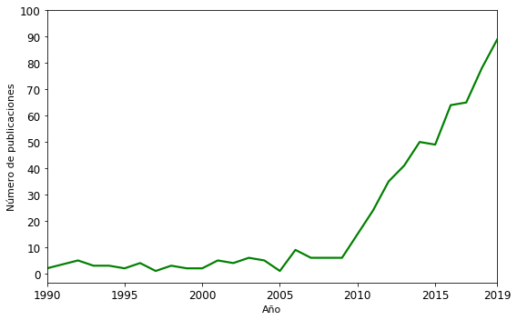
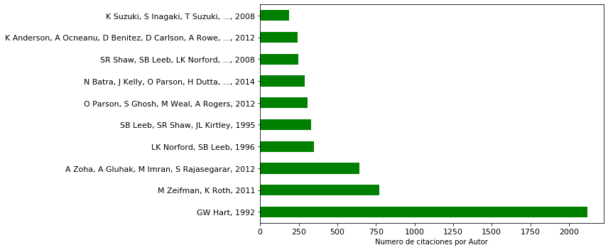

# Publicaciones NILM/NILMTK - Estado del Arte

Se usa el programa [Publish or Perish](https://harzing.com/resources/publish-or-perish/windows) para realizar una busqueda de las publicaciones en [GoogleScholar](https://scholar.google.es/)

El criterio de busqueda contempla las publicaciones que en su titulo tengan las siguientes palabras:
- Non-Intrusive Load Monitoring
- Nonintrusive Load Monitoring

Adicionalmente se realiza una búsqueda para las publicaciones que en sus palabras clave hagan referencia a NILMTK

La busqueda se realiza entre los años 1990 y 2019 (consulta al 27 de Diciembre de 2019)

**Idea original de Oliver Parson:** 
- http://blog.oliverparson.co.uk/2015/03/overview-of-nilm-field.html
- https://github.com/oliparson/nilm-papers


```python
%matplotlib inline
import numpy as np
import pandas as pd
import matplotlib.pyplot as plt
from matplotlib import rcParams
```

## Publicaciones NILM

### Archivo CSV de consulta de publicaciones NILM


```python
df=pd.read_csv('/notebooks/Publicaciones/NILM_search.csv')#, encoding = 'latin1')
df.sort_values(by='Cites', inplace=True, ascending=False)
print(df.shape)
df.head(3)
```

<table border="1" class="dataframe">
  <thead>
    <tr style="text-align: right;">
      <th></th>
      <th>Cites</th>
      <th>Authors</th>
      <th>Title</th>
      <th>Year</th>
      <th>Source</th>
      <th>Publisher</th>
      <th>ArticleURL</th>
      <th>CitesURL</th>
      <th>GSRank</th>
      <th>QueryDate</th>
      <th>...</th>
      <th>CitationURL</th>
      <th>Volume</th>
      <th>Issue</th>
      <th>StartPage</th>
      <th>EndPage</th>
      <th>ECC</th>
      <th>CitesPerYear</th>
      <th>CitesPerAuthor</th>
      <th>AuthorCount</th>
      <th>Age</th>
    </tr>
  </thead>
  <tbody>
    <tr>
      <th>152</th>
      <td>2118</td>
      <td>GW Hart</td>
      <td>Nonintrusive appliance load monitoring</td>
      <td>1992</td>
      <td>Proceedings of the IEEE</td>
      <td>ieeexplore.ieee.org</td>
      <td>https://ieeexplore.ieee.org/abstract/document/...</td>
      <td>https://scholar.google.com/scholar?cites=13659...</td>
      <td>7</td>
      <td>2020-01-11 17:36:20</td>
      <td>...</td>
      <td>NaN</td>
      <td>NaN</td>
      <td>NaN</td>
      <td>NaN</td>
      <td>NaN</td>
      <td>2118</td>
      <td>75.64</td>
      <td>2118</td>
      <td>1</td>
      <td>28</td>
    </tr>
    <tr>
      <th>146</th>
      <td>771</td>
      <td>M Zeifman, K Roth</td>
      <td>Nonintrusive appliance load monitoring: Review...</td>
      <td>2011</td>
      <td>IEEE transactions on Consumer …</td>
      <td>ieeexplore.ieee.org</td>
      <td>https://ieeexplore.ieee.org/abstract/document/...</td>
      <td>https://scholar.google.com/scholar?cites=11426...</td>
      <td>13</td>
      <td>2020-01-11 17:36:20</td>
      <td>...</td>
      <td>NaN</td>
      <td>NaN</td>
      <td>NaN</td>
      <td>NaN</td>
      <td>NaN</td>
      <td>771</td>
      <td>85.67</td>
      <td>386</td>
      <td>2</td>
      <td>9</td>
    </tr>
    <tr>
      <th>199</th>
      <td>642</td>
      <td>A Zoha, A Gluhak, M Imran, S Rajasegarar</td>
      <td>Non-intrusive load monitoring approaches for d...</td>
      <td>2012</td>
      <td>Sensors</td>
      <td>mdpi.com</td>
      <td>https://www.mdpi.com/1424-8220/12/12/16838</td>
      <td>https://scholar.google.com/scholar?cites=18443...</td>
      <td>1</td>
      <td>2020-01-11 17:36:20</td>
      <td>...</td>
      <td>NaN</td>
      <td>NaN</td>
      <td>NaN</td>
      <td>NaN</td>
      <td>NaN</td>
      <td>642</td>
      <td>80.25</td>
      <td>161</td>
      <td>4</td>
      <td>8</td>
    </tr>
  </tbody>
</table>
<p>3 rows × 23 columns</p>
### Numero de publicaciones NILM por año


```python
rcParams['figure.figsize'] = (8, 5)
nonzero_years = df[(df.Year>=1990) & (df.Year<=2019)]
pd.DataFrame(nonzero_years.Year.value_counts()).sort_index().plot(color='g', linewidth=2.2, fontsize=12, legend=False)
plt.xlabel('Año', fontsize=11)
plt.ylabel('Número de publicaciones', fontsize=11)
a=[1990, 1995, 2000, 2005, 2010, 2015, 2019]
plt.xticks(a)
plt.xlim(1990, 2019)
plt.yticks(np.arange(0, 101, 10))
plt.tight_layout() #no corta el eje
```





### Numero de citaciones por Autor


```python
plt.figure(figsize=(12,5))
df['Author, year'] = df['Authors'] + ', ' + [str(x) for x in df['Year']]
df.set_index('Author, year').Cites.head(10).plot(kind='barh', color='g', fontsize=11)
plt.xlabel('Numero de citaciones por Autor')
plt.ylabel('')
plt.tight_layout()
```





### Numero de citaciones por año


```python
plt.figure(figsize=(12,5))
df.set_index('Author, year').sort_values(by='CitesPerYear',ascending=False)['CitesPerYear'].head(15).plot(kind='barh', color='g', fontsize=11)
plt.ylabel('')
plt.xlabel('Número de citas por año')
plt.tight_layout()
```


